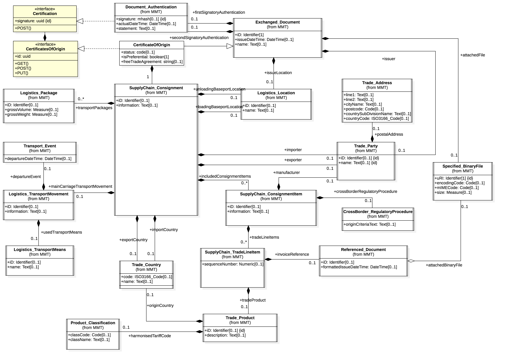

## Introduction

Regulatory processes often involve certificates that assert compliance of a shipment with some specification or legislative framework.  For example

* A Certificate of Origin (CoO) is issued by an accredited body on behalf of an exporter and is required by the importing regulator.  It asserts that the goods in a consignment conform to the terms of a Free Trade Agreement (FTA) and so may attract concenssional duty terms.
* A Certifictae of Non Manipulation (CoNM) is issued by an accredited body on behalf of a transhipment port/country and it asserts that goods in a consignment were not altered during transhipment.
* A PhtoSanitary certificate is issued by an accredity authority on behalf of an exporter of food products and is required to meet the food safety standards of the importing regulator.
* And dozens of others.

In most cases certificates are about a consignment of goods. Accordingly, the edi3 approach to defining the data model of certifictaes is to "attach" certificate data to the existing UN/CEFACT trade and transport data models.

## Goals

To publish a consistent suite of data models and state lifecycles for various certifictaes used to satisfy regulatory processes and to support the [Inter Customs Ledger](https://edi3.org/icl/) project.

## Status

* This specification is in  state.  This means that design consensus has been reached and the specification is ready for implementation verification.

## Glossary

Phrase | Definition
------------ | -------------
CoO|Certificate of Origin
CoNM|Certificate of Non Manipulation
FTA|Free Trade Agreement
RDM|Reference Data Model
 
## Licence

All material published on edi3.org including all parts of this specification are the intellectual property of the UN as per the [UN/CEFACT IPR Policy](https://www.unece.org/fileadmin/DAM/cefact/cf_plenary/plenary12/ECE_TRADE_C_CEFACT_2010_20_Rev2E_UpdatedIPRpolicy.pdf).

This Specification is free software; you can redistribute it and/or modify it under the terms of the GNU General Public License as published by the Free Software Foundation; either version 3 of the License, or (at your option) any later version. See http://www.gnu.org/licenses.
 
## Change Process

This document is governed by the [2/COSS](http://rfc.unprotocols.org/spec:2/COSS/) (COSS).

## Language

The key words "MUST", "MUST NOT", "REQUIRED", "SHALL", "SHALL NOT", "SHOULD", "SHOULD NOT", "RECOMMENDED", "MAY", and "OPTIONAL" 
in this document are to be interpreted as described in RFC 2119.

# Certificate Of Origin

## Data Model

The Certificate of Origin (CoO) Data model is drawn from the UN/CEFACT Buy-Ship-Pay reference data model and conforms to the edi3 [UML profile specification](https://edi3.org/specs/edi3-uml-profile/master/)

## State Lifecycle

The certificate state lifecycle is shown below.  The "status" property of the "CertificateOfOrigin" entity in the API model MUST equal one of these values.

## Open API Soecification

The Data Model has been used to generate an API Specification in accordance with [Open API3.0](https://github.com/OAI/OpenAPI-Specification/blob/master/versions/3.0.0.md) standard. The API specifciation is published in YML and HTML (swagger UI)

* As an [OpenAPI3.0 YAML file](CertificateOfOrigin.yml)
* As a [browsable HTML swagger UI page](https://edi3.org/specs/edi3-regulatory/develop/certificates/CertificateOfOrigin.html)

## JSON Schema

For use via other protocols than OpenAPI, a [CoO JSON schema](CertificateOfOrigin.schema.json) is also provided 

## Sample Data

to assist with implementaiton and with mapping to typical PDF certificate layouts, some sample data files are provided. All samples use the same data set which represents a CHAFTA preferential certificate for an export of 6 pallets of 3 different wine products from Australia to China.

* As a [PDF document](CertificateOfOrigin.sampleFull.pdf)
* As [JSON full data set](CertificateOfOrigin.sampleFull.json)
* As [JSON minimum mandatory data set](CertificateOfOrigin.sampleMinimal.json)

It is expected that simple implementations may permit the exchange of certificates as PDF files with supporting structured meta-data.  This use case is supported by this specificaiton.  Typically implementers will

* either implement the full data set as structured JSON
* or implement the mimimal data set as structured JSON and include the PDF certificate as URL reference.

# Certificate of Non Manipulation

To be completed
 
# Related Material

 * [CHAFTA CoO Template PDF](chafta-coo-template.pdf)
 * [JAEPA CoO Template](jaepa-coo-template.pdf)
 * [CoO data mapping UN / WCO Excel](CertificateOfOriginDataElementMapping.xlsx)