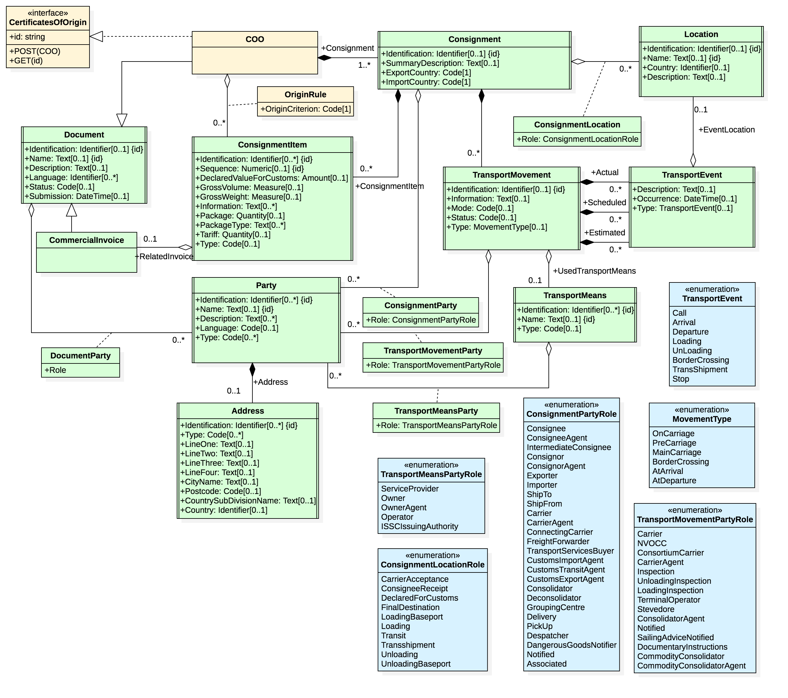
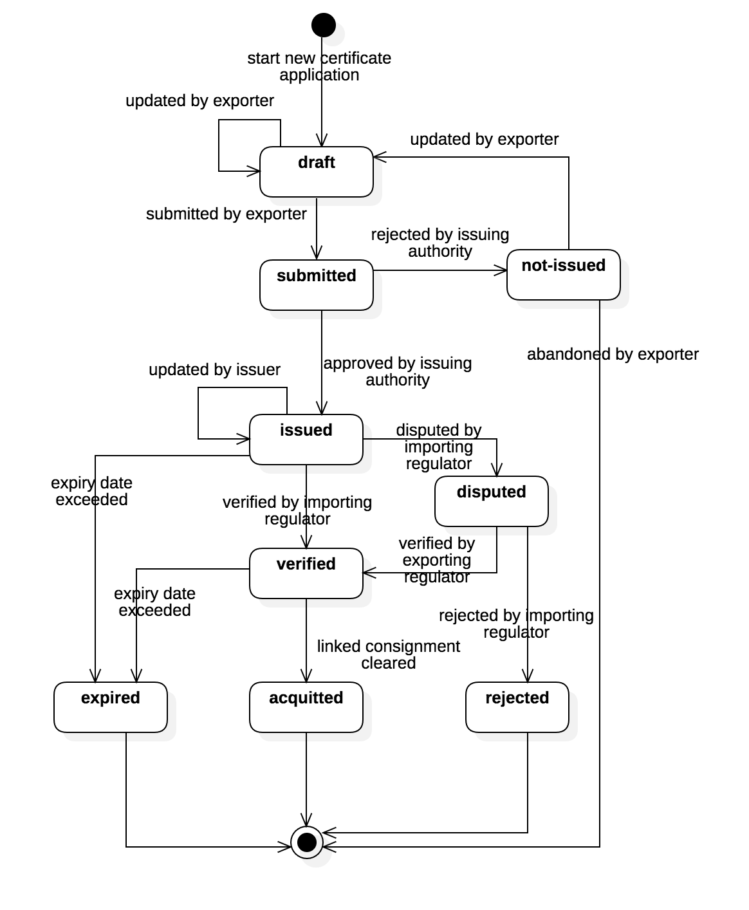

## Introduction

Regulatory processes often involve certificates that assert compliance of a shipment with some specification or legislative framework.  For example

* A Certificate of Origin (CoO) is issued by an accredited body on behalf of an exporter and is required by the importing regulator.  It asserts that the goods in a consignment conform to the terms of a Free Trade Agreement (FTA) and so may attract concenssional duty terms.
* A Certifictae of Non Manipulation (CoNM) is issued by an accredited body on behalf of a transhipment port/country and it asserts that goods in a consignment were not altered during transhipment.
* A PhtoSanitary certificate is issued by an accredity authority on behalf of an exporter of food products and is required to meet the food safety standards of the importing regulator.
* And dozens of others.

In most cases certificates are about a consignment of goods. Accordingly, the edi3 approach to defining the data model of certifictaes is to "attach" certificate data to the existing UN/CEFACT trade and transport data models.

## Goals

To publish a consistent suite of data models and state lifecycles for various certifictaes used to satisfy regulatory processes and to support the [Inter Customs Ledger](https://edi3.org/icl/) project.


## Status

* This specification is in  state.  This means that design consensus has been reached and the specification is ready for implementation verification.


## Glossary

Phrase | Definition
------------ | -------------
CoO|Certificate of Origin
CoNM|Certificate of Non Manipulation
FTA|Free Trade Agreement
RDM|Reference Data Model
 
## Licence

All material published on edi3.org including all parts of this specification are the intellectual property of the UN as per the [UN/CEFACT IPR Policy](https://www.unece.org/fileadmin/DAM/cefact/cf_plenary/plenary12/ECE_TRADE_C_CEFACT_2010_20_Rev2E_UpdatedIPRpolicy.pdf).

This Specification is free software; you can redistribute it and/or modify it under the terms of the GNU General Public License as published by the Free Software Foundation; either version 3 of the License, or (at your option) any later version. See http://www.gnu.org/licenses.
 
## Change Process

This document is governed by the [2/COSS](http://rfc.unprotocols.org/spec:2/COSS/) (COSS).

## Language

The key words "MUST", "MUST NOT", "REQUIRED", "SHALL", "SHALL NOT", "SHOULD", "SHOULD NOT", "RECOMMENDED", "MAY", and "OPTIONAL" 
in this document are to be interpreted as described in RFC 2119.

# Certificate Of Origin

## Data Model

The Certificate of Origin (CoO) Data model is drawn from the UN/CEFACT Buy-Ship-Pay reference data model and conforms to the edi3 [UML profile specification](https://edi3.org/specs/edi3-uml-profile/master/)





## State Lifecycle

The certificate state lifecycle is shown below.  The "status" property of the "CertificateOfOrigin" entity in the API model MUST equal one of these values.



## API Specification

The Data Model has been used to generate a [CoO REST API specification](https://edi3.org/specs/edi3-regulatory/develop/certificates/CertificateOfOrigin.html) in accordance with the [Open API3.0](https://github.com/OAI/OpenAPI-Specification/blob/master/versions/3.0.0.md) standard. 

The full open API schema definition is provided below.

```
openapi: 3.0.0
info:
  description: ''
  title: CertificateOfOrigin
  version: ''
servers: []
paths:
  /CertificatesOfOrigin:
    get:
      tags:
        - CertificatesOfOrigin
      description: Get a list of CertificateOfOrigin
      parameters: []
      responses:
        '200':
          description: OK
          content:
            application/json:
              schema:
                items:
                  $ref: '#/components/schemas/CertificateOfOrigin'
                type: array
    post:
      tags:
        - CertificatesOfOrigin
      description: Create a new CertificateOfOrigin
      requestBody:
        content:
          application/json:
            schema:
              $ref: '#/components/schemas/CertificateOfOrigin'
        description: ''
        required: true
      responses:
        '201':
          content:
            application/json:
              schema:
                $ref: '#/components/schemas/CertificateOfOrigin'
          description: Created
  '/CertificatesOfOrigin/{id}':
    get:
      tags:
        - CertificatesOfOrigin
      description: Get single CertificateOfOrigin by id
      parameters:
        - name: id
          in: path
          description: missing description
          required: true
          schema:
            type: string
      responses:
        '200':
          description: OK
          content:
            application/json:
              schema:
                $ref: '#/components/schemas/CertificateOfOrigin'
    put:
      tags:
        - CertificatesOfOrigin
      description: Update an existing CertificateOfOrigin
      parameters:
        - name: id
          in: path
          description: missing description
          required: true
          schema:
            type: string
      requestBody:
        content:
          application/json:
            schema:
              $ref: '#/components/schemas/CertificateOfOrigin'
        description: ''
        required: true
      responses:
        '200':
          description: OK
          content:
            application/json:
              schema:
                $ref: '#/components/schemas/CertificateOfOrigin'
components:
  schemas:
    CertificateOfOrigin:
      description: ''
      type: object
      properties:
        status:
          description: missing description
          type: string
        isPreferential:
          description: missing description
          type: boolean
        freeTradeAgreement:
          description: missing description
          type: string
        SupplyChain_Consignment:
          allOf:
            - description: ''
            - $ref: '#/components/schemas/SupplyChain_Consignment'
      allOf:
        - $ref: '#/components/schemas/Exchanged_Document'
        - type: object
      required:
        - status
        - isPreferential
        - SupplyChain_Consignment
    CrossBorder_RegulatoryProcedure:
      description: >-
        A set of formal steps to satisfy a cross-border regulation, law or
        convention.
      type: object
      properties:
        originCriteriaText:
          description: >-
            The origin criteria, expressed as text, for this cross-border
            regulatory procedure.
          type: string
    Document_Authentication:
      description: A proof that a document is genuine.
      type: object
      properties:
        actualDateTime:
          description: >-
            The actual date, time, date time, or other date time value of this
            document authentication.
          type: string
        statement:
          description: 'The statement, expressed as text, for this document authentication.'
          type: string
    Exchanged_Document:
      description: >-
        A collection of data for a piece of written, printed or electronic
        matter that is exchanged between two or more parties.
      type: object
      properties:
        iD:
          description: The unique identifier of this exchanged document.
          type: string
        issueDateTime:
          description: >-
            The date, time, date time or other date time value for the issuance
            of this exchanged document.
          type: string
        name:
          description: 'A name, expressed as text, of this exchanged document.'
          type: string
        attachedFile:
          allOf:
            - description: A binary file attached to this exchanged document.
            - $ref: '#/components/schemas/Specified_BinaryFile'
        firstSignatoryAuthentication:
          allOf:
            - description: >-
                The first or primary signature that authenticates this exchanged
                document.
            - $ref: '#/components/schemas/Document_Authentication'
        issueLocation:
          allOf:
            - description: The location where this exchanged document has been issued.
            - $ref: '#/components/schemas/Logistics_Location'
        issuer:
          allOf:
            - description: The party that issues this exchanged document.
            - $ref: '#/components/schemas/Trade_Party'
    Logistics_Location:
      description: A logistics related physical location or place.
      type: object
      properties:
        iD:
          description: >-
            A unique identifier for this logistics related location, such as a
            United Nations Location Code (UNLOCODE) or GS1 Global Location
            Number (GLN).
          type: string
        name:
          description: 'A name, expressed as text, of this logistics related location.'
          type: string
    Logistics_Package:
      description: >-
        A self-contained wrapping or container within which goods can be
        contained for logistics purposes, such as a box or a barrel which can be
        filled, partially filled or empty.
      type: object
      properties:
        sequenceNumber:
          description: The sequence number of this logistics package.
          type: string
        grossVolume:
          description: The measure of the gross volume of this logistics package.
          type: string
        grossWeight:
          description: >-
            The measure of the gross weight (mass) of this logistics package and
            its contents.
          type: string
    Logistics_TransportMeans:
      description: >-
        The devices used to convey goods or other objects from place to place
        during logistics cargo movements.
      type: object
      properties:
        iD:
          description: >-
            An identifier of this logistics means of transport, such as the
            International Maritime Organization number of a vessel.
          type: string
        name:
          description: 'The name, expressed as text, of this logistics means of transport.'
          type: string
    Logistics_TransportMovement:
      description: >-
        The conveyance (physical carriage) of goods or other objects used for
        logistics transport purposes.
      type: object
      properties:
        iD:
          description: >-
            The unique identifier for this logistics transport movement, such as
            a voyage number, flight number, or trip number.
          type: string
        information:
          description: >-
            Information, expressed as text, for this logistics transport
            movement.
          type: string
        usedTransportMeans:
          allOf:
            - description: >-
                The means of transport used for this logistics transport
                movement.
            - $ref: '#/components/schemas/Logistics_TransportMeans'
    Product_Classification:
      description: >-
        A systematic arrangement of products in classes or categories according
        to established criteria.
      type: object
      properties:
        classCode:
          description: The code specifying the class for this product classification.
          type: string
        className:
          description: 'A class name, expressed as text, for this product classification.'
          type: string
    Referenced_Document:
      description: 'Written, printed or electronic matter that is referenced.'
      type: object
      properties:
        iD:
          description: A unique identifier for this referenced document.
          type: string
        attachedBinaryFile:
          allOf:
            - description: A specified binary file attached to this referenced document.
            - $ref: '#/components/schemas/Specified_BinaryFile'
    Specified_BinaryFile:
      description: A specified computer file or program stored in a binary format.
      type: object
      properties:
        uRI:
          description: >-
            The unique Uniform Resource Identifier (URI) for this specified
            binary file.
          type: string
        encodingCode:
          description: The code specifying the encoding of this specified binary file.
          type: string
        mIMECode:
          description: >-
            The code specifying the Multipurpose Internet Mail Extensions (MIME)
            type for this specified binary file.
          type: string
        size:
          description: The measure of the size of this specified binary file.
          type: string
    SupplyChain_Consignment:
      description: >-
        A separately identifiable collection of goods items to be transported or
        available to be transported from one consignor to one consignee in a
        supply chain via one or more modes of transport where each consignment
        is the subject of one single transport contract.
      type: object
      properties:
        iD:
          description: A unique identifier for this supply chain consignment.
          type: string
        exportCountry:
          allOf:
            - description: The export country for this supply chain consignment.
            - $ref: '#/components/schemas/Trade_Country'
        exporter:
          allOf:
            - description: The party who exports this supply chain consignment.
            - $ref: '#/components/schemas/Trade_Party'
        importCountry:
          allOf:
            - description: The import country for this supply chain consignment.
            - $ref: '#/components/schemas/Trade_Country'
        importer:
          allOf:
            - description: The party who imports this supply chain consignment.
            - $ref: '#/components/schemas/Trade_Party'
        includedConsignmentItem:
          items:
            $ref: '#/components/schemas/SupplyChain_ConsignmentItem'
          type: array
          description: A consignment item included in this supply chain consignment.
        loadingBaseportLocation:
          allOf:
            - description: >-
                The baseport location at which this supply chain consignment is
                to be loaded on a means of transport according to the transport
                contract.
            - $ref: '#/components/schemas/Logistics_Location'
        mainCarriageTransportMovement:
          allOf:
            - description: >-
                A main carriage logistics transport movement for this supply
                chain consignment.
            - $ref: '#/components/schemas/Logistics_TransportMovement'
        transportPackage:
          items:
            $ref: '#/components/schemas/Logistics_Package'
          type: array
          description: Transport packages for this supply chain consignment.
        unloadingBaseportLocation:
          allOf:
            - description: >-
                The baseport location at which this supply chain consignment is
                to be unloaded from a means of transport according to the
                transport contract.
            - $ref: '#/components/schemas/Logistics_Location'
    SupplyChain_ConsignmentItem:
      description: >-
        An item within a supply chain consignment of goods separately identified
        for transport and customs purposes.
      type: object
      properties:
        iD:
          description: A unique identifier for this supply chain consignment item.
          type: string
        information:
          items:
            description: >-
              Information, expressed as text, for this supply chain consignment
              item.
            type: string
          type: array
        crossBorderRegulatoryProcedure:
          allOf:
            - description: >-
                A cross-border regulatory procedure applicable to this supply
                chain consignment item.
            - $ref: '#/components/schemas/CrossBorder_RegulatoryProcedure'
        manufacturer:
          allOf:
            - description: The party which manufactured this supply chain consignment item.
            - $ref: '#/components/schemas/Trade_Party'
        tradeLineItem:
          allOf:
            - description: >-
                A trade line item included in this supply chain consignment
                item.
            - $ref: '#/components/schemas/SupplyChain_TradeLineItem'
    SupplyChain_TradeLineItem:
      description: >-
        A collection of information specific to an item being used or reported
        on for supply chain trade purposes.
      type: object
      properties:
        sequenceNumber:
          description: A sequence number for this supply chain trade line item.
          type: string
        description:
          description: >-
            The code specifying a description of this supply chain trade line
            item.
          type: string
        invoiceReference:
          allOf:
            - description: A document referenced for this supply chain trade line item.
            - $ref: '#/components/schemas/Referenced_Document'
        tradeProduct:
          allOf:
            - description: The product specified for this supply chain trade line item.
            - $ref: '#/components/schemas/Trade_Product'
    Trade_Address:
      description: >-
        The location at which a particular trade related organization or person
        may be found or reached.
      type: object
      properties:
        line1:
          description: missing description
          type: string
        line2:
          description: missing description
          type: string
        cityName:
          description: >-
            The name, expressed as text, of the city, town or village of this
            trade address.
          type: string
        postcode:
          description: A code specifying the postcode of this trade address.
          type: string
        countrySubDivisionName:
          description: >-
            A name, expressed as text, of the sub-division of a country for this
            trade address.
          type: string
        countryCode:
          allOf:
            - description: The unique identifier of a country for this trade address.
            - $ref: '#/components/schemas/ISO3166_Code'
    ISO3166_Code:
      $ref: >-
        https://edi3.org/shared/openapi/ISO/codes.yml#/components/schemas/ISO3166_Code
    Trade_Country:
      description: >-
        The area of land that belongs to a nation together with its properties,
        such as population, political organization, etc., used or referenced for
        trade purposes.
      type: object
      properties:
        code:
          allOf:
            - description: A unique identifier for this trade country.
            - $ref: '#/components/schemas/ISO3166_Code'
        name:
          description: 'A name, expressed as text, of this trade country.'
          type: string
    Trade_Party:
      description: >-
        An individual, a group, or a body having a role in a trade business
        function.
      type: object
      properties:
        iD:
          description: A unique identifier of this trade party.
          type: string
        name:
          description: 'The name, expressed as text, for this trade party.'
          type: string
        postalAddress:
          allOf:
            - description: The postal address for this trade party.
            - $ref: '#/components/schemas/Trade_Address'
    Trade_Product:
      description: >-
        Any tangible output or service produced by human or mechanical effort or
        by a natural process for trade purposes.
      type: object
      properties:
        iD:
          description: A unique identifier for this trade product.
          type: string
        description:
          description: A textual description for this trade product.
          type: string
        harmonisedTariffCode:
          allOf:
            - description: A product classification designated for this trade product.
            - $ref: '#/components/schemas/Product_Classification'
        originCountry:
          allOf:
            - description: A country of origin for this trade product.
            - $ref: '#/components/schemas/Trade_Country'
```

# Certificate of Non Manipulation

To be completed
 
# Related Material

 * [CHAFTA CoO Template PDF](chafta-coo-template.pdf)
 * [JAEPA CoO Template](jaepa-coo-template.pdf)
 * [CoO data mapping UN / WCO Excel](CertificateOfOriginDataElementMapping.xlsx)